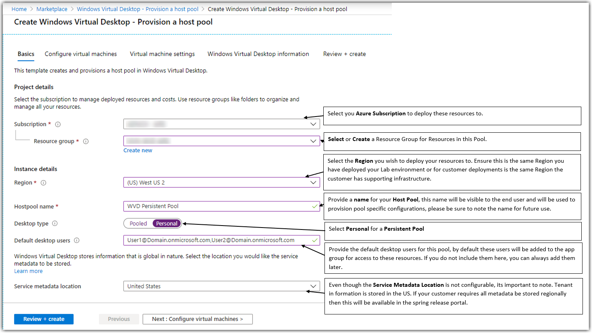
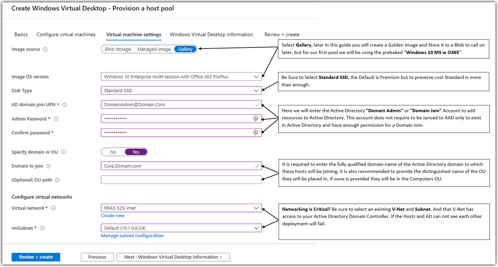
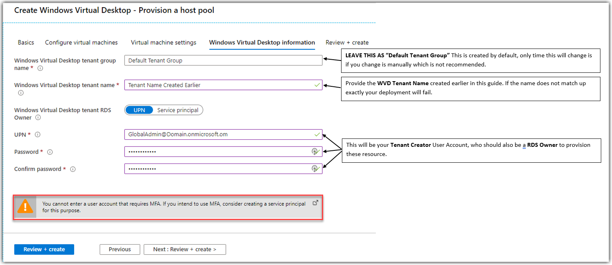
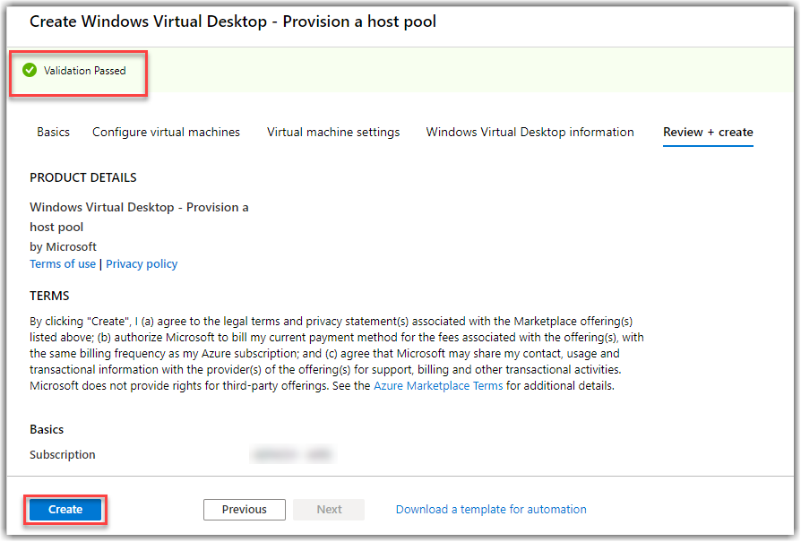
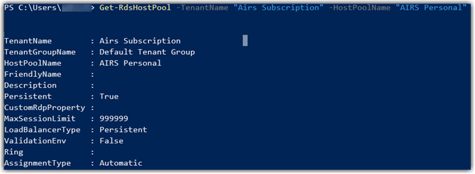
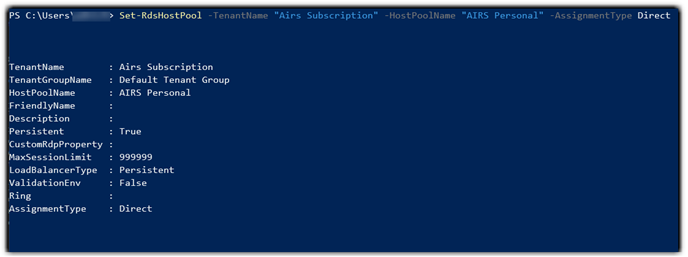

# Lab 5: Deploy a Perssonal Host Pool

--------------------------------------------------------

Now that we have provisioned a Windows Virtual Desktop Tenant, we can now deploy
a Host Pool to publish resources to our users.

Your Windows Virtual Desktop tenant is the management space for Host Pools, one
of the host pool types is Personal Hosts. This means that the Host will be
statically assigned to a single user or multiple users. In this situation the
user logs into the same host every single time. We treat Persistent host much he
same way we do traditional workstations, since they are typically running 24/7,
they need to be patched and maintained like a typical workstation.

There are many ways to deploy a Personal Host Pool in this guide we will focus
on leveraging the Azure Marketplace. But for more advanced deployments you can
use ARM templates as is documented in the Advanced Deployment section of this
guide.

<https://docs.microsoft.com/en-us/azure/virtual-desktop/create-host-pools-azure-marketplace>

---

1.Browse to <https://portal.azure.com> and search for **Marketplace**.

    

2. While in the **marketplace** search for **Windows Virtual Desktop** and
    Select **Provision a host pool**


3. Select the **Create** button to provision this service**.**

 

---

This type of deployment is often referred to as the Market Place deployment,
because the backend logic of this template is managed by Microsoft. As discussed
earlier there are other ARM templates on GitHub and other repositories managed
by Microsoft and 3rd parties.

You can use the Market Place deployment to deploy a new Host Pool or to
provision additional resources to an existing host pool. To achieve this just
ensure the Tenant Name and Host Pool Name entered are Identical to the existing
deployment. But in this case, we will be deploying a Host Pool for the first
time.

4. Fill in the Marketplace Deployment follow the notes below for guidance.

    

5. Select **Next: Configure virtual machines** to continue.

    

6. Select **Next: Virtual machine settings**

7. Fill in the Marketplace Deployment follow the notes below for guidance.

    

8. Select **Next: Windows Virtual Desktop information**

9. Fill in the Marketplace Deployment follow the notes below for guidance.

    

10.  Select **Next: Review + Create**

---

11.  Wait for a **Validation Passed,** if you get a fail examine the error and
    resolve the failure.

   

12.  Finally Select **Create.** To start your Host Pool Deployment.

13.  You can watch the **progress** of the deployment this will take about 15 min
    or so, so it might be a good time to stretch your legs and take a break.

   !image](attachments/763dbbfd0796fd7afecf51de9562d959.png)

You should eventually receive a message **“Your Deployment is complete”.** If
you receive a failure message refer to the step it failed at and refer to the
troubleshooting section on this guide.

   

---

You have successfully deployed a Personal Host Pool by default the Assignment Type for all Personal or Persistent Pools is set to Automatic. This means as users log in they will be assigned to a Host until there are no more host available. This can be change to Direct using the command line below, if Direct is chosen then you must assign every resource to every Host manually.


```PowerShell
Get-RdsHostPool -TenantName "Tenant Name" -HostPoolName "Host Pool Name"
```



```PowerShell
Set-RdsHostPool -TenantName "Tenant Name" -HostPoolName "Host Pool Name" -AssignmentType Direct
```




---
Now use the following commands to assign a user directly to a host.

https://docs.microsoft.com/en-us/azure/virtual-desktop/configure-host-pool-personal-desktop-assignment-type#configure-automatic-assignment

This first cmd will ensure the user is a member of the Application Pool, this is required to have access to see the session host. If you added the user in the default desktop users above the user will already exsists in this group.
```PowerShell
Add-RdsAppGroupUser <tenantname> <hostpoolname> "Desktop Application Group" -UserPrincipalName <userupn>
```
This command will assign a user by UPN to a session host directly. You will need to pull the session host name in advance to enter it here. This can be found easily in the Azure Portal under Virtual Machines.
```PowerShell
Set-RdsSessionHost <tenantname> <hostpoolname> -Name <sessionhostname> -AssignedUser <userupn>
```
