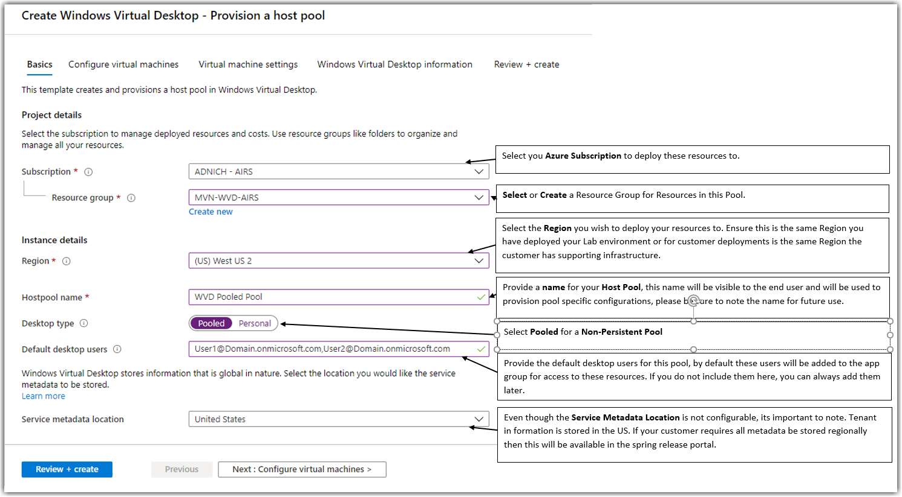

# Lab 6: Deploy a Pooled Host Pool

--------------------------------------------------------

Now that we have provisioned a Windows Virtual Desktop Tenant, we can now deploy
a Host Pool to publish resources to our users.

Your Windows Virtual Desktop tenant is the management space for Host Pools, one
of the host pool types is Pooled Hosts. This means that the Host will be managed
in a pool and dynamically assigned to a host. In this situation the user logs
into the WVD Service and will be assigned the next available host, this means we
need a solution for profiles in this case we will use FSLogix which is
configured later in this guide.

There are many ways to deploy a Pooled Host Pool in this guide we will focus on
leveraging the Azure Marketplace. But for more advanced deployments you can use
ARM templates as is documented in the Advanced Deployment section of this guide.

<https://docs.microsoft.com/en-us/azure/virtual-desktop/create-host-pools-azure-marketplace>

---
 1.  Browse to <https://portal.azure.com> and search for **Marketplace**.

   

2.  While in the **marketplace** search for **Windows Virtual Desktop** and
    Select **Provision a host pool**

    

3.  Select the **Create** button to provision this service**.**

    

---

This type of deployment is often referred to as the Market Place deployment,
because the backend logic of this template is managed by Microsoft. As discussed
earlier there are other ARM templates on GitHub and other repositories managed
by Microsoft and 3rd parties.

You can use the Market Place deployment to deploy a new Host Pool or to
provision additional resources to an existing host pool. To achieve this just
ensure the Tenant Name and Host Pool Name entered are Identical to the existing
deployment. But in this case, we will be deploying a Host Pool for the first
time.

   

Fill in the Marketplace Deployment follow the notes below for guidance.

4.  Select **Next: Configure virtual machines** to continue.

    

Fill in the Marketplace Deployment follow the notes below for guidance.

5.  Select **Next: Virtual machine settings**

6.  Fill in the Marketplace Deployment follow the notes below for guidance.

    

7.  Select **Next: Windows Virtual Desktop information**

8.  Fill in the Marketplace Deployment follow the notes below for guidance.

   

9.  Select **Next: Review + Create**

10.  Wait for a **Validation Passed,** if you get a fail examine the error and
    resolve the failure.

   

11.  Finally Select **Create.** To start your Host Pool Deployment.

---

12.  You can watch the **progress** of the deployment this will take about 15 min
    or so, so it might be a good time to stretch your legs and take a break.

   

You should eventually receive a message **“Your Deployment is complete”.** If
you receive a failure message refer to the step it failed at and refer to the
troubleshooting section on this guide.


Now use the following commands to ensure your users are a member of the Pooled Host pool.

This cmd will ensure the user is a member of the Application Pool, this is required to have access to see the session host. If you added the user in the default desktop users above the user will already exists in this group.
```PowerShell
Add-RdsAppGroupUser <tenantname> <hostpoolname> "Desktop Application Group" -UserPrincipalName <userupn>
```

You have successfully deployed a Pooled Host Pool move on to the Test WVD
Deployment Exercise to validate your deployment.
