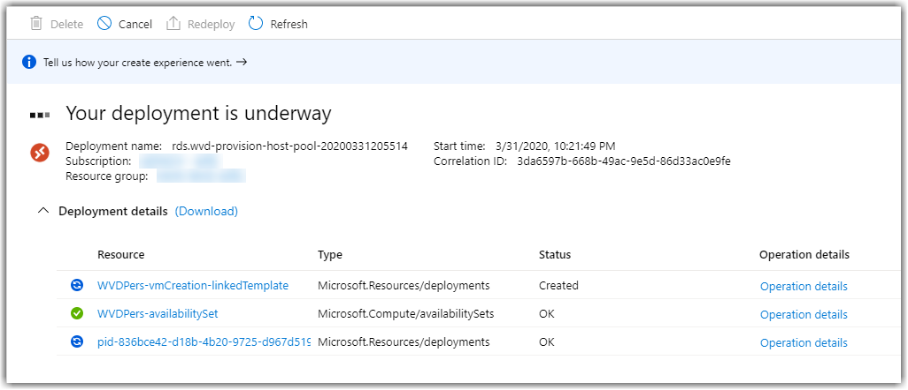
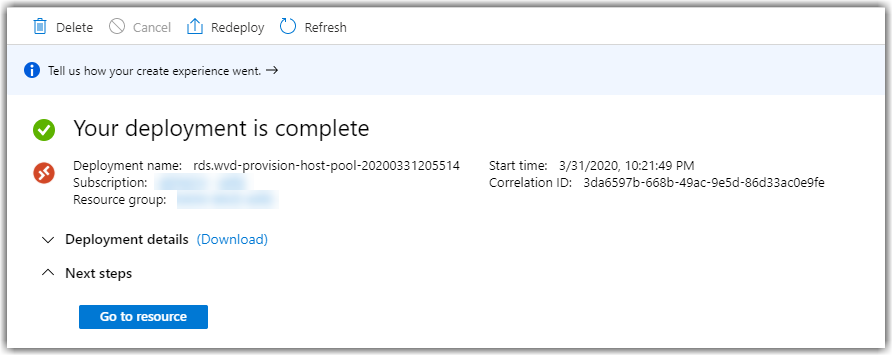

# Lab 8: Deploy a Personal Host Pool

Now that we have provisioned a Windows Virtual Desktop Tenant, we can now deploy a Host Pool to publish resources to our users.

Your Windows Virtual Desktop tenant is the management space for Host Pools, one of the host pool types is Personal Hosts. This means that the Host will be statically assigned to a single user or multiple users. In this situation the user logs into the same host every single time. We treat Persistent host much the same way we do traditional workstations, since they are typically running 24/7, they need to be patched and maintained like a typical workstation.

There are many ways to deploy a Personal Host Pool however we will focus on leveraging the Azure Marketplace. For more advanced deployments you can use ARM templates as is documented here: [Tutorial: Create a host pool by using the Azure Marketplace](https://docs.microsoft.com/en-us/azure/virtual-desktop/create-host-pools-azure-marketplace)

## Exercise 1 - Provision a Personal Host Pool

1. Return to the [Azure Portal](https://portal.azure.com) and search for **Marketplace**.  
    > **NOTE:** Ensure that you are in the correct directory and subscription.

    

2. While in the **Marketplace** search for **Windows Virtual Desktop - Provision a host pool**

    

3. Select the **Windows Virtual Desktop - Provision a host pool** and then click the **Create** button to provision this service.

    

4. Complete the **Basics** tab with the following information:
    * Resource Group: **WVDLab**
    * Region: **Choose the same region where you placed previous resources**
    * Hostpool name: **PersonalPool**
    * Desktop type: **Personal**
5. Complete the **Configure virtual machines** tab with the following information:
    * Total users: **2** 
        >This will create 2 hosts and join them to AD and this pool.
    * Virtual machine size: *Change Size* and select **B2s** 
        >This size is fine for lab purposes but you would choose larger VMs for production.
    * Virtual machine name prefix: **WVDPers**
        >This prefix will be used in combination with the VM number to create the VM name. If using 'rdsh' as the prefix, VMs would be named 'rdsh-0', 'rdsh-1', etc. You should use a unique prefix to reduce name collisions in Active Directory and in Windows Virtual Desktop.
6. Complete the **Virtual machine settings** tab with the following information:
    * AD domain join UPN: **WVDAdmin@(your AD Domain Name)** (e.g. adadmin@wagswvd.com)
        >UPN of an Active Directory user that has permissions and will be used to join the virtual machines to your domain.  If you didn't write this down you can return to your RDP session with the domain controller and obtain the information.
    * Admin Password: `Complex.Password`
    * Confirm password: `Complex.Password`
    * Virtual network: **Select the existing virtual network you created earlier**
    * vmSubnet: **Select the existing subnet you created earlier**

7. Complete the **Windows Virtual Desktop information** tab with the following information:
    * Windows Virtual Desktop tenant group name
        >**DO NOT CHANGE THIS NAME!**
    * Windows Virtual Desktop tenant name:  wvdXYZlabs.onmicrosoft.com
        >Provide the tenant name used earlier. If the name does not exactly match your deployment will fail.  If your PowerShell window is still open you should be able to retrieve the name there.
    * UPN: **WVDAdmin@(your Azure AD Domain Name)** (e.g. wvdadmin@domain.onmicrosoft.com)
    * Password: `Complex.Password`
    * Confirm password: `Complex.Password`

8. Select **Next: Review + Create**. Wait for a **Validation Passed,** if you get a failure examine the **Activity log** in the Azure portal and resolve the failure.

   

9. Finally Select **Create.** To start your Host Pool Deployment.

10. You can watch the **progress** of the deployment this will take about 15 min or so, so it might be a good time to stretch your legs and take a break.

   

You should eventually receive a message **“Your Deployment is complete”.** If
you receive a failure message refer to the step it failed at and refer to the
troubleshooting section on this guide.

   

Congrats! You have successfully deployed a Personal Host Pool by default the Assignment Type for all Personal or Persistent Pools is set to Automatic. This means as users log in they will be assigned to a Host until there are no more host available. This can be change to Direct using the command line below, if Direct is chosen then you must assign every resource to every Host manually.


```PowerShell
Get-RdsHostPool -TenantName "Tenant Name" -HostPoolName "Host Pool Name"
```


```PowerShell
Set-RdsHostPool -TenantName "Tenant Name" -HostPoolName "Host Pool Name" -AssignmentType Direct
```


---
Now use the following commands to assign a user directly to a host.

https://docs.microsoft.com/en-us/azure/virtual-desktop/configure-host-pool-personal-desktop-assignment-type#configure-automatic-assignment

This first cmd will ensure the user is a member of the Application Pool, this is required to have access to see the session host. If you added the user in the default desktop users above the user will already exsists in this group.
```PowerShell
Add-RdsAppGroupUser <tenantname> <hostpoolname> "Desktop Application Group" -UserPrincipalName <userupn>
```
This command will assign a user by UPN to a session host directly. You will need to pull the session host name in advance to enter it here. This can be found easily in the Azure Portal under Virtual Machines.
```PowerShell
Set-RdsSessionHost <tenantname> <hostpoolname> -Name <sessionhostname> -AssignedUser <userupn>
```
