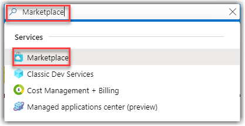

# Lab 9: Deploy a Pooled Host Pool

Now that we have provisioned a Personal Host Pool, we can now deploy a Pooled Host Pool to publish resources to our users.

## Exercise 1 - Provision a Pooled Host Pool

1. Return to the [Azure Portal](https://portal.azure.com) and search for **Marketplace**.  
    > **NOTE:** Ensure that you are in the correct directory and subscription.

    

2. While in the **Marketplace** search for **Windows Virtual Desktop - Provision a host pool**

    

3. Select the **Windows Virtual Desktop - Provision a host pool** and then click the **Create** button to provision this service.

    

4. Complete the **Basics** tab with the following information:
    * Resource Group: **WVDLab**
    * Region: **Choose the same region where you placed previous resources**
    * Hostpool name: **PooledPool**
    * Desktop type: **Pooled**

5. Complete the **Configure virtual machines** tab with the following information:
    * Create an Availability Set: **No**
    * Usage Profile: **Custom**
        > Select a usage profile to determine the number of users per vCPU--Light (6), Medium (4), or Heavy (2)--to use to calculate the number of virtual machines to create based on the selected VM size. If you would like to create a specific number of VMs, select 'Custom'.
    * Total users: **2**
        >This will create 2 hosts and join them to AD and this pool.
    * Virtual machine size: *Change Size* and select **B2s**
        >This size is fine for lab purposes but you would choose larger VMs for production.
    * Virtual machine name prefix: **WVDPool**
        >This prefix will be used in combination with the VM number to create the VM name. If using 'WVDPool' as the prefix, VMs would be named 'WVDPool-0', 'WVDPool-1', etc. You should use a unique prefix to reduce name collisions in Active Directory and in Windows Virtual Desktop.

6. Complete the **Virtual machine settings** tab with the following information:
    * AD domain join UPN: **WVDAdmin@(your AD Domain Name)** (e.g. adadmin@wagswvd.com)
        >UPN of an Active Directory user that has permissions and will be used to join the virtual machines to your domain.  If you didn't write this down you can return to your RDP session with the domain controller and obtain the information.
    * Admin Password: `Complex.Password`
    * Confirm password: `Complex.Password`
    * Virtual network: **Select the existing virtual network you created earlier, do not create a new VNET**
    * vmSubnet: **Select the existing subnet you created earlier**

7. Complete the **Windows Virtual Desktop information** tab with the following information:
    * Windows Virtual Desktop tenant group name
        >**DO NOT CHANGE THIS NAME!**
    * Windows Virtual Desktop tenant name:  wvdXYZlabs.onmicrosoft.com
        >Provide the tenant name used earlier. If the name does not exactly match your deployment will fail.  If your PowerShell window is still open you should be able to retrieve the name there.
    * UPN: **WVDAdmin@(your Azure AD Domain Name)** (e.g. wvdadmin@domain.onmicrosoft.com)
    * Password: `Complex.Password`
    * Confirm password: `Complex.Password`

8. Select **Next: Review + Create**. Wait for a **Validation Passed,** and if you get a failure examine the **Activity log** in the Azure portal and resolve the failure.

   

9. Select **Create** to start your Host Pool Deployment.

10. You can watch the progress of the deployment.  Note that this will take about 15 minutes or so to complete, so it might be a good time to stretch your legs and take a break.

    
11. You should eventually receive a message **“Your Deployment is complete”.**

    

Congrats! You have successfully deployed a Pooled Host Pool!  

### Return to [Deploy Phase Labs](deploy.md)
