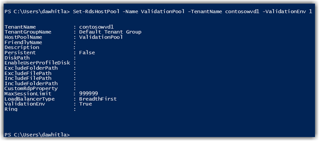

# Lab 12: Test Your WVD Deployment

In this lab your will validate the personal and Pooled Windows Virtual Desktop pools that you created by connecting to them via the Windows Desktop Client and the Web Client.

## Exercise 1 - Connect with the Windows Desktop client

1. Choose the client that matches your version of Windows:
    * [Windows 64-bit](https://go.microsoft.com/fwlink/?linkid=2068602)
    * [Windows 32-bit](https://go.microsoft.com/fwlink/?linkid=2098960)
    * [Windows ARM64](https://go.microsoft.com/fwlink/?linkid=2098961)
2. Complete a default installation and select the box for **Launch Remote Desktop when setup exits.**
3. In the Remote Desktop client, click on **Subscribe**.
4. When prompted enter the credentials for Bob Jones:
    * Username: `Bob.Jones@yourdomain.onmicrosoft.com`
    * Password: `Complex.Password`
5. Click **Yes** on the next screen and the **Done** on the following screen.
6. Click on the icon for Personal Pool.
7. When prompted, enter the password: `Complex.Password`.
8. Once connected, change the desktop background to a different picture.
9. Disconnect from the session.

## Exercise 2 - Connect with the Windows Virtual Desktop web client

1. In a browser, navigate to the [Windows Virtual Desktop web client](https://rdweb.wvd.microsoft.com/webclient).
2. When prompted enter the credentials for Julia Williams:
    * Username: Julia.Williams@`yourdomain`.onmicrosoft.com
    * Password: `Complex.Password`
    > **NOTE:** These credentials are to logon and authenticate to the Windows Virtual Desktop Service.
3. Click on the icon for PooledPool.
4. Click **Allow** on the **Access local resources** window.
5. When prompted enter the following credentials:
    * Username: wvdadmin@`yourADdomain`
    * Password: `Complex.Password`
    > **NOTE:** These credentials are to logon to a computer in the pool.
6. Once connected, change the desktop background to a different picture.
7. Disconnect from the session.

## Exercise 3 - Host Pool Validation Tag

By default, the WVD agent on each host will auto update as new versions release. You can prevent this behavior by setting the **ValidationEng** flag in a host pool to true (by default it’s set to false). With the ValidationEng flag set to true ONLY the host in that host pool will auto update giving administrators control to test new WVD host images, and the newest agents before rolling to production.

To enable this setting follow the PowerShell steps below.

1. Return to your PowerShell window.

2. Enter the following:

```powershell
Add-RDSAccount -DeploymentUrl
[https://rdbroker.wvd.microsoft.com](https://rdbroker.wvd.microsoft.com/)
```

### Choose a Host Pool for the validation pool

1. Enter the following:

    ```powershell
    Set-RdsHostPool -Name <HostPoolName> -TenantName <yourTenantName>
    -ValidationEnv $True or $False
    ```

    

## Exercise 4 - Other Common Settings

### Tenant Friendly Name

You can give your WVD Tenant a friendly name that will look less technical.

1. Enter the following:

    ```powershell
    Set-RdsTenant -Name \<WVD Tenant\> -FriendlyName "Contoso WVD"
    ```

### Desktop Friendly Name

Using the `Set-RdsRemoteDesktop`PowerShell cmdlet the FriendlyName option allows you customize the name users see on the Web Client or Thick Client.

1. Enter the following:

    ```powershell
    Set-RdsRemoteDesktop -TenantName <tenant> -HostPoolName <Host Pool>
    -AppGroupName "Desktop Application Group" -FriendlyName "<enter a friendly name>"
    ```

### Return to [Optimize Phase Labs](optimize.md)
