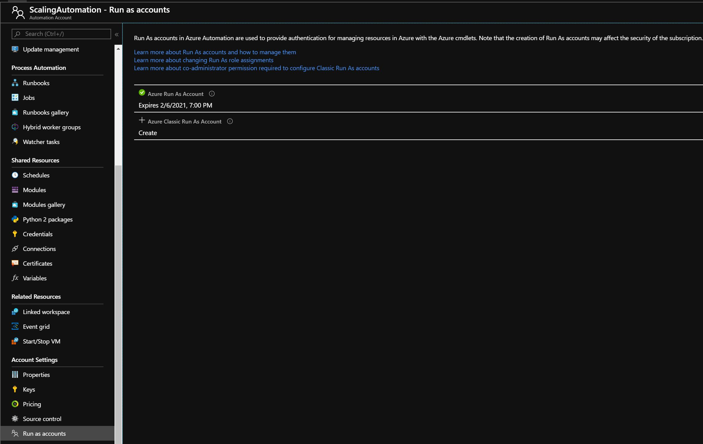
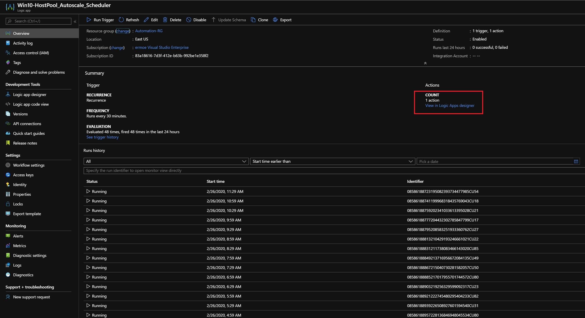
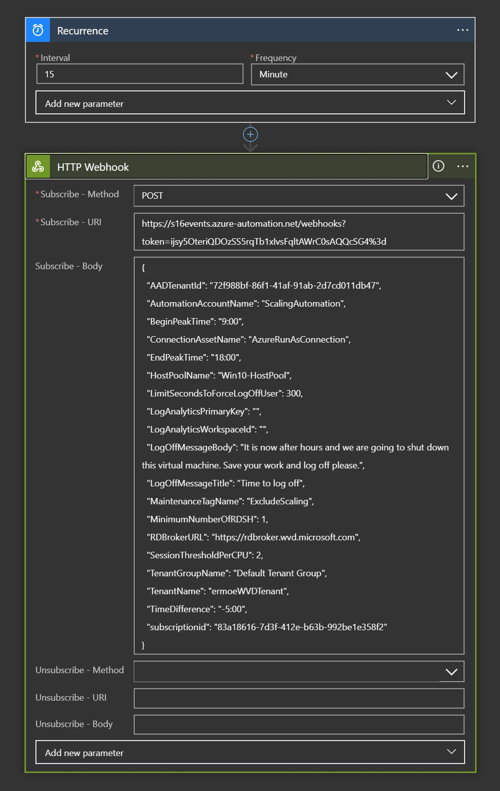
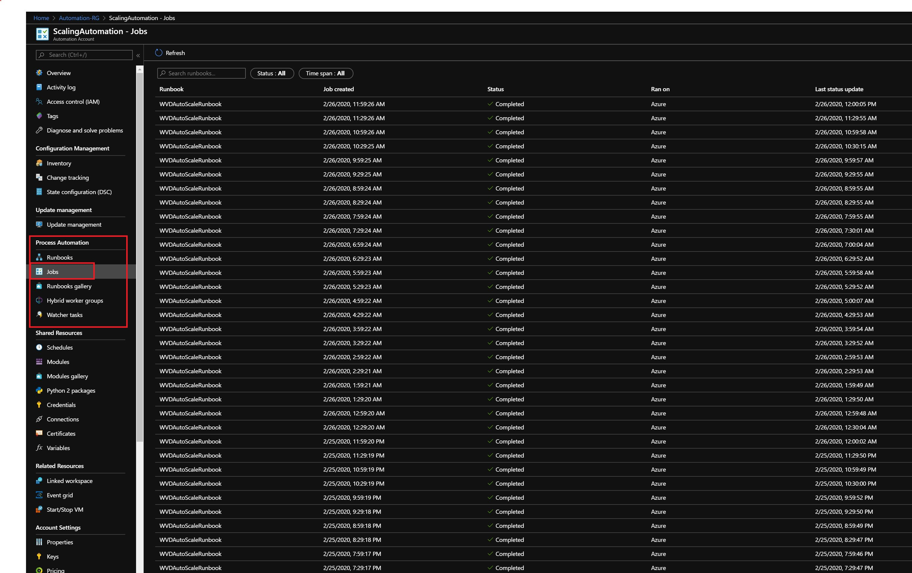
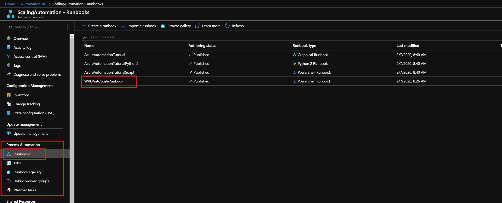
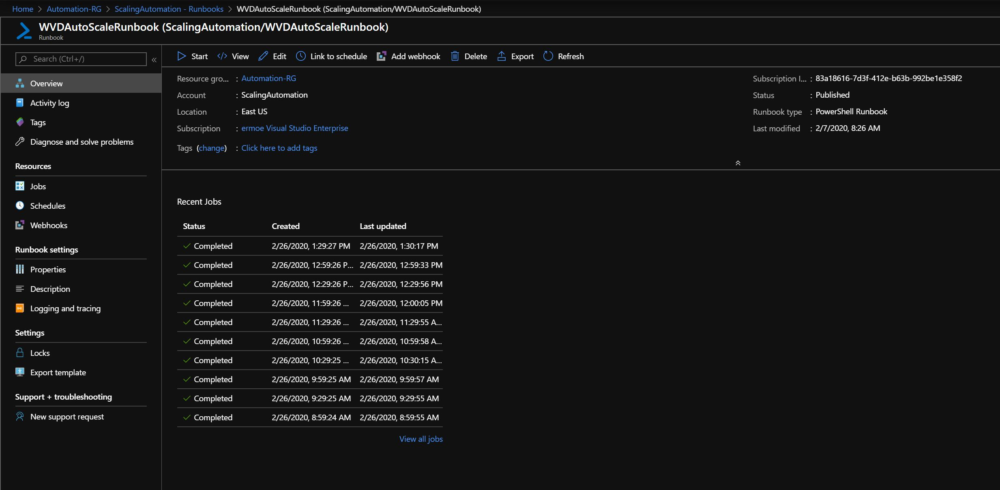
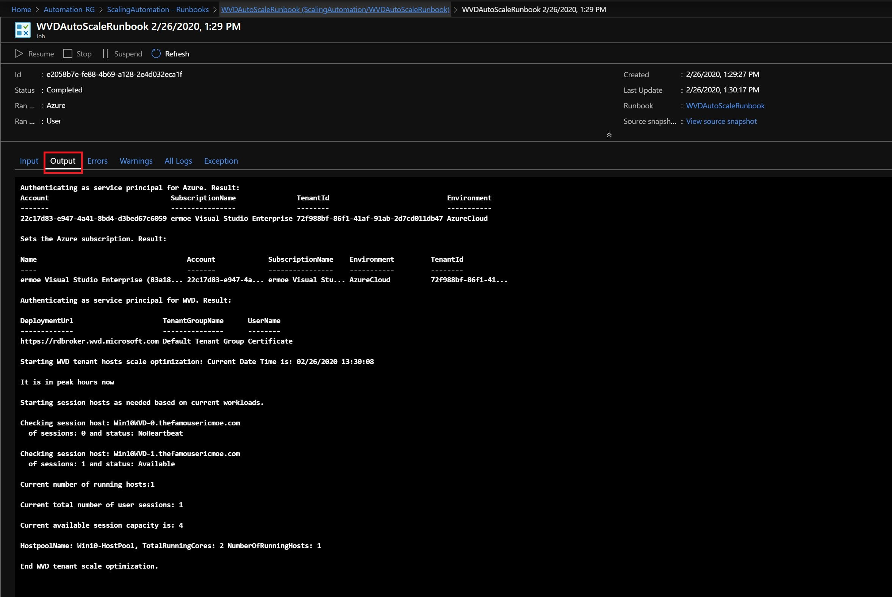
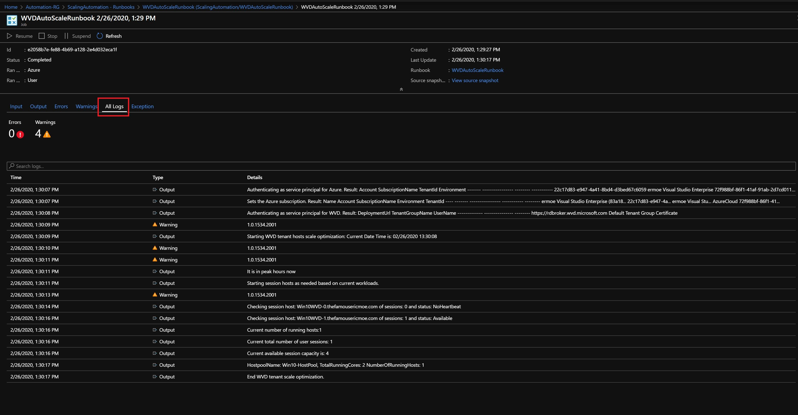

# Lab 16: WVD Scaling

To reduce overall operational costs, scaling VM's down during idle periods is critical. Being able to automatically scale up when utilization is high is also important for our customers.
The first release of Windows Virtual Desktop did not include any native scaling capabilities. In February 2020 a scaling script based on Azure Automation was released.

The scaling tool can be used to do the following:

* Schedule VMs to start and stop based on Peak and Off-Peak business hours
* Scale out VMs based on number of sessions per CPU core
* Scale in VMs during off-peak hours, leaving a minimum number of session host VMs running

The scaling tool uses the following Azure capabilities:

* Azure Automation PowerShell runbooks

* Azure Webhooks
* Azure Logic Apps

The solution will use several variables to specify the session behavior. The variables are described in the table below.

 **Variable** | **Usage** 
--------------|-----------
SessionThresholdPerCPU | Used to determine if the number of currently running session host VMs can support the existing number of sessions
MinimumNumberOfRDSH | Determines which session host VMs should be shut down during off-peak usage time
LimitSecondsToForceLogOffUser | When set to non-zero positive value, notify currently signed-in users to save work, wait the configured amount of time,  and then force the users to sign off.    Once all users have signed out, the script will shut down the VM.  When set to 0, GPO will be used to determine Session Time Limits.

#Create an Azure Automation Account

Open Windows PowerShell as Administrator.

Run the following cmdlet to sign into your Azure Account with your Azure Global Administrator account.

    Login-AzAccount

Next you will download a script from Github that will install the automation script and create the Azure Automation account.
Replace your local machine path in the script block below with a local path to your device to download the script into.

    Invoke-WebRequest -Uri "https://raw.githubusercontent.com/Azure/RDS-Templates/master/wvd-templates/wvd-scaling-script/createazureautomationaccount.ps1" -OutFile "<your local machine path>\createazureautomationaccount.ps1"

Execute the previous code block to download the createazureautomationaccount.ps1 script.

Next, use the following script block to create your automation account.
You will need your Azure Subscription ID, Resource Group name, the name you want to use for your Automation Account and Azure location before you begin.
Copy the following script block into PowerShell ISE and modify the variables appropriately.

    $subscriptionID = "<paste in your Azure subcription id>"
    $resourceGroupName = "<paste in the RG name of your WVD resources>"
    $automationAccountName = "<select a unique name for your automation account>"
    $AzureRegion = "<paste in the region your WVD resources are deployed to>"

    .\createazureautomationaccount.ps1 -SubscriptionID $subscriptionID -ResourceGroupName $resourceGroupName -AutomationAccountName $AutomationAccountName -Location $AzureRegion

Execute the previous script block from the *local path you downloaded the automation script into*.

The script output will include a **webhook URI**. **Copy** the webhook URI into PowerShell ISE because we will use it later as a parameter when setting up the execution schedule for the Azure Logic App.

    $webHookURI = "<paste in the webhook URI>"

After the script has completed, navigate to your Resource Group in the Azure Portal and verify you see an Automation Account and a runbook has been added. 

You can also verify your webhook is configured by selecting the new Runbook, navigating to your Resource list on the left side of the Azure portal, and then selecting **Webhook**.

#Create an Azure Automation Run As Account

An Azure Automation Run As account provides authentication for managing resources in Azure with Azure cmdlets. 
When you create a Run As account, it creates a new service principal user in Azure Active Directory and assigns the Contributor role to the service principal user at the subscription level.
 The Azure Run As Account authenticates securely with certificates and a service principal name without needing to store a username and password in a credential object.

 Any user who is a member of the Subscription Administrators role and co-administrator of the subscription can create a Run As account. Use the following steps to converts the Automation Account you just created into a Run As Account.

 - [ ] In the Azure portal, select **All Services**. In the list of resources, select **Automation Accounts**

 - [ ] On the **Automation Accounts** page, select the name of the Automation Account you just created

 - [ ] In the pane on the left side of the window, select **Run As Accounts** under the *Account Settings* section.

 - [ ] Select **Azure Run As Account**. When the **Add Azure Run As Account** pane appears, review the information and then click **Create** to start the account creation process.

 - [ ] The resource will provision in a few minutes.

 After it completes, you will see an asset named _AzureRunAsConnection_ in your Automation Account. The connection asset holds the application ID, tenant ID, subscription ID and the certificate thumbprint.

 **Copy** the **Application ID** to PowerShell ISE as you will need it later.

    $AzureAutomationRunAsApplicationId = "<paste in the application ID>"

#Create Role Assignment for the Azure Automation Account within WVD

 

Now we will need to create a role assignment so that the AzureRunAsConnection can interact with WVD.

We will re-use the Windows Virtual Desktop PowerShell module that you should have installed in previous labs.

First, connect to your Windows Virtual Desktop environment and display your tenant(s):

    Add-RdsAccount -DeploymentUrl "https://rdbroker.wvd.microsoft.com"

    Get-RdsTenant

In this lab you should only have one tenant that contains your host pools. If you created more that one tenant, select the tenant you wish to apply the scaling automation to.

Copy your WVD tenant name to PowerShell ISE.

    $WVDTenantName = "<paste in the WVD tenant name>"

Execute the following PowerShell commands to add the RDS Contributor role to the Azure Automation Run As Account

    $webHookURI = "<paste in the webhook URI>"

    $AzureAutomationRunAsApplicationId = "<paste in the application ID>"

    $WVDTenantName = "<paste in the WVD tenant name>"

    New-RdsRoleAssignment -RoleDefinitionName "RDS Contributor" -ApplicationId $AzureAutomationRunAsApplicationId -TenantName $WVDTenantName

#Set up Azure Logic App

The next step is to create the Azure Logic App that will handle scaling automation. This is performed using a script downloaded from GitHub.

The first steps are to connect to your Azure account and downoad the script file locally to your machine. Copy the script block below into PowerShell ISE and modify the local machine path.

    Login-AzAccount

    Invoke-WebRequest -Uri "https://raw.githubusercontent.com/Azure/RDS-Templates/master/wvd-templates/wvd-scaling-script/createazurelogicapp.ps1" -OutFile "<your local machine path>\createazurelogicapp.ps1"

Run the previous code to connect to your Azure account and download the createazurelogicapp.ps1 locally.

After the script has downloaded, we need to then sign into WVD with an account that has RDS Owner or RDS Contributor permissions.

    Add-RdsAccount -DeploymentUrl "https://rdbroker.wvd.microsoft.com"

Next, we are going to use a block of PowerShell code that will install and configure the Azure Logic App. 
This block of PowerShell contains variables that should already have been set in PowerShell ISE as part of executing this lab.
The previously set variables are blocked together in the top of this code block.
Copy the code below into PowerShell ISE, replacing the variables at the top of the script with values previously set in PowerShell ISE.

    # Previously set variables:

    $resourceGroupName = "<paste in the RG name of your WVD resources>"
    $subscriptionId =  "<paste in your Azure subcription id>"
    $WVDTenantName = "<paste in the WVD tenant name>"
    $webHookURI = "<paste in the webhook URI>"
    $automationAccountName = "<select a unique name for your automation account>"
    $AzureRegion = "<paste in the region your WVD resources are deployed to>"

    # New variables:

    # The following must be the AAD Tenant where the automation account is registered
    $aadTenantId = "<paste in Azure AD Tenant ID> 

    # The following must be the name of the WVD host pool you want to automate the scaling feature for
    $hostPoolName = "<paste in the WVD host pool you wish to automate scaling in>"

    # The following is how long you want the job to run in minutes    
    $recurrenceInterval = "15"

    # The following is the start time for peak usage hours in local time. 
    $beginPeakTime = "9:00"

    # The following is the end time for peak usage hours in local time.
    $endPeakTime = "18:00"

    # The following is the difference between your local time and UTC.
    $timeDifference = "-5:00"

    # The following is the maximum number of sessions per CPU that will be used as the threshold to determine when new session host VMs need to be started during PEAK HOURS
    $sessionThresholdPerCPU = "2"

    # The following is the minimum number of session hosts VMs to keep running during OFF PEAK hours
    $minimumNumberOfRdsh = "1"

    # The following is the time limit of seconds to wait before automatically signing users off when scaling down
    $limitSecondsToForceLogOffUser = "300"

    # The following is the title of the log off message box, you can customize this to read however you want.
    $logOffMessageTitle = "Time to log off"

    # The following is the message body of the log off message box, you can customize this to read however you want.
    $logOffMessageBody = "It is now after hours and we are going to shut down this virtual machine. Save your work and log off please."

    # The following is the Azure Run As Connection name. If you followed the steps in this lab guide, the name will be set to AzureRunAsConnection
    $connectionAssetName = "AzureRunAsConnection"

    # The following is the name of the Tag associated with VMs that you do not want to be managed by the scaling tool
    $maintenanceTagName = "ExcludeScaling"

    .\createazurelogicapp.ps1 -ResourceGroupName $resourceGroupName `
    -AADTenantID $aadTenantId `
    -SubscriptionID $subscriptionId `
    -TenantName $WVDtenantName `
    -HostPoolName $hostPoolName `
    -RecurrenceInterval $recurrenceInterval `
    -BeginPeakTime $beginPeakTime `
    -EndPeakTime $endPeakTime `
    -TimeDifference $timeDifference `
    -SessionThresholdPerCPU $sessionThresholdPerCPU `
    -MinimumNumberOfRDSH $minimumNumberOfRdsh `
    -LimitSecondsToForceLogOffUser $limitSecondsToForceLogOffUser `
    -LogOffMessageTitle $logOffMessageTitle `
    -LogOffMessageBody $logOffMessageBody `
    -Location $AzureRegion `
    -ConnectionAssetName $connectionAssetName `
    -WebHookURI $webHookURI `
    -AutomationAccountName $automationAccountName `
    -MaintenanceTagName $maintenanceTagName

The remaining variables can be configured based on the guidance in the script block. Once you have configured the variables, **execute the entire code block** to create the Azure Logic App.

After completion, the Logic App will appear in your Resource Group.

To make changes to the execution schedule, go to the Autoscale scheduler resource and select View in Logic Apps Designer. 

Next, select a View in Logic Apps Designer.

Once you have opened the Logic Apps Designer, you can expand both the Recurrence and the HTTP Webhook as shown below.

You can modify the interval (frequency) by which the job runs in the Recurrence box.
In the HTTP Webhook component you can modify other variables including the session thresholds, time difference, beginning and ending peak time, etc.

#Manage The Scaling Tool

## Viewing Job Status

You can view a summarized status of all runbook jobs in the Azure portal. 

First, navigate to the Automation Account associated with this scaling script. In the left pane, under _Process Automation_ select **Jobs**

You will see a list of runbook statuses in the Azure portal similar to the image below.

## Viewing Logs and Scaling Tool output

You can view the logs of scale-out and scale-in operations by first navigating back to your Automaiton Account and then selecting Runbooks from under Process Automation.

In the results, select the WVDAutoScaleRunbook.

On the Overview blade for the WVDAutoScaleRunbook, you will see a list of recent jobs as shown in the image below

**Click** on one of the recent jobs. 

On the new page, you will see a variety of tabs on the blade: *Input, Output, Errors, Warnings, All Logs and Exception*. 

***Click** on **Output** to see the job output from running the job.

 

Click on **All Logs** to see each individually logged event with timestamps.

 

 
