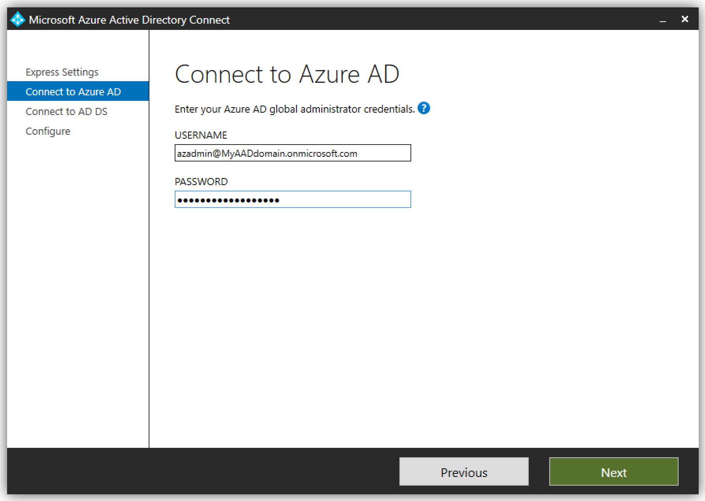
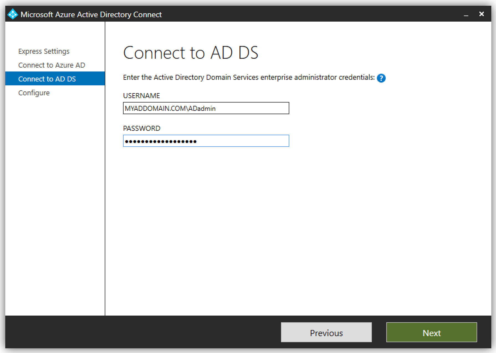

Exercise 4: Configuring Azure AD Connect with AD DS
---------------------------------------------------
---
In this exercise you will be configuring [Azure AD Connect](https://docs.microsoft.com/en-us/azure/active-directory/hybrid/whatis-azure-ad-connect). With Windows Virtual Desktop, all session host VMs within the WVD tenant environment are required to be domain joined to AD DS, and the domain must be synchronized with Azure AD. To manage the synchronization of objects, you will configure Azure AD Connect on the domain controller deployed in Azure.

> *Note:* RDP access to a domain controller using a public IP address is not a best practice and is 
> only done to simplify this lab. Better security practices such as removing the PIP,
> enabling just-in-time access and/or leveraging a bastion host should be applied enhance security. 
>
> **This lab should not be deployed into a production environment.**
---
## Task 1: Connecting to the domain controller 
1. Sign in to the [Azure Portal](https://portal.azure.com/).                                                                                    
2. Type **Resource groups** in the search field and select it from the list. 
3. On the Resource groups blade, click on the **Infra** resource group. 
4. On the Infra Resource group blade, review the list of available resources. Locate the resource named **AdPubIP1** and click on it. Note that the resource type should be **Public IP address**.
5. On the Overview page for AdPubIP1, locate the **IP address** field. Copy the IP address to a safe location.

6. On your local machine, open the **RUN** dialog window, type **MSTSC** and hit enter.
7. In the **Remote Desktop Connection** window, paste in the public IP address from the previous step. Click **Connect**.
8. When prompted, sign in with the AD domain UPN credentials. For example, if you used the ARM template from [Exercise 3](/Windows-Virtual-Desktop-on-Azure-Lab/Prerequisites/Exercise-3:-Deploying-Azure-Infrastructure-and-AD-DS), the credentials will be something along the lines of: **adadmin@MyADDomain.com** with the password: **WVD\@zureL\@b2019!**. If prompted, click **Yes** to accept the RDP certification warning.

   > **Note:** This is the Active Directory account from the ARM template, not the
   > Azure AD Global Admin account. If you have trouble signing in, try typing 
   > the credentials in manually, as copy and paste may include an unnecessary 
   > space, which will cause authentication to fail.
   
---

## Task 2: Disabling IE Enhanced Security

In an effort to simplify tasks in this lab, we will start by disabling [IE Enhanced Security](https://docs.microsoft.com/en-us/windows-hardware/customize/desktop/unattend/microsoft-windows-ie-esc).
1. Once connected to the domain controller, open Server Manager if it does not start automatically.
2. In Server Manager, select **Local Server** on the left.
3. Locate the **IE Enhanced Security Configuration** option and click **On**. 

   
  
4. On the Internet Explorer Enhanced Security Configuration window, under **Administrators**, select the **Off** radio button and click **OK**.
---
## Task 3: Creating a Domain Admin account
By default, Azure AD Connect does not synchronize the built-in domain administrator account *ADAdmin\@MyADDomain.com*. This system account has the attribute `isCriticalSystemObject` set to *true*, preventing it from being synchronized. While it is possible to modify this, it is not a best practice to do so.   
1. In Server Manager, click **Tools** in the upper right corner and select **Active Directory Users and Computers**.
2. In Active Directory Users and Computers, right-click the **Users** organization unit and select **New > User** from the menu.
3. Complete the New User wizard.

   > *Tip:* This account will be important in future tasks. Make a note of the username and password 
   > you create. When setting the password, uncheck the box **User must change password at next logon**. 

4. In Active Directory Users and Computers, right-click on the new user account object and select **Add to a group**. 
5. On the Select Groups dialog window, type **Domain Admins** and click **OK**.

   > **Note:** This account will be used during the host pool creation process for joining the hosts 
   > to the domain. Granting Domain Admin permissions will simplify the lab. However, any Active
   > Directory account that has the following permissions will suffice. This can
   > be done using [Active Directory Delegate
   > Control.](https://danielengberg.com/domain-join-permissions-delegate-active-directory/)
   >
   > - Create computer objects
   > - Delete computer object
 ---
## Task 4: Configuring Azure AD Connect                                                                                                                                                                                                                                         
1. On the desktop of the domain controller, locate the icon for **Azure AD Connect** and double-click on it.                                                                                                                                                                      
2. Click **Use express settings**. The required components will install.
3. On the Connect to Azure AD page, enter in the Azure AD Global Admin credentials. For example: **azadmin@MyAADdomain.onmicrosoft.com** and the correct password. Click **Next**.

   

4. On the Connect to AD DS page, enter in the Active Directory credentials for a Domain Admin account. For example, if you used the ARM template deployment for the domain controller, the credentials will be something along the lines of: **MyADDomain.com\ADadmin** with the password: **WVD\@zureL\@b2019!**. Click **Next**

   > **Note:** If you copy and paste the password, please ensure that there are no trailing
   > spaces, as that will cause the verification to fail.

   

5. Click **Install** to start the configuration and synchronization.   
6. After a few minutes the Azure AD Connect installation will complete. Click **Exit**.
7. Minimize the RDP session for the domain controller and wait a few minutes for the AD accounts to 
be synchronized to Azure AD.
8. Sign in to the [Azure Portal](https://portal.azure.com/).
9. Type **Azure Active Directory** in the search field and select it from the list.
10. On the Azure Active Directory blade, under **Manage**, select **Users**.
11. Review the list of user account objects and confirm the test accounts have synchronized, as shown below. 

    

    > **Note:** It can take up to 15 minutes for the Active Directory objects to be synchronized to the 
    > Azure AD tenant.

