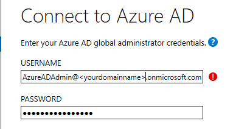

# Lab 3: Configuring Azure AD Connect with AD DS

In this exercise you will be configuring [Azure AD Connect](https://docs.microsoft.com/en-us/azure/active-directory/hybrid/whatis-azure-ad-connect). With Windows Virtual Desktop, all session host VMs within the WVD tenant environment are required to be domain joined to AD DS, and the domain must be synchronized with Azure AD. To manage the synchronization of objects, you will configure Azure AD Connect on the domain controller deployed in Azure.

> *Note:* RDP access to a domain controller using a public IP address is not a best practice and is only done to simplify this lab. Better security practices such as removing the PIP, enabling just-in-time access and/or leveraging a bastion host should be applied enhance security.

---

## Exercise 1 - Connecting to the domain controller

1. Sign in or switch to the [Azure Portal](https://portal.azure.com/).

2. Type **Resource groups** in the search field and select it from the list.

3. On the Resource groups blade, click on the **WVDLab** resource group.

4. On the WVDLab Resource group blade, review the list of available resources. Locate the resource named **AdPubIP1** and click on it. Note that the resource type should be **Public IP address**.

5. On the Overview page for AdPubIP1, locate the **IP address** field. Copy the IP address to a safe location.

   

6. On your local machine, open the **RUN** dialog window, type **MSTSC** and hit enter.

7. In the **Remote Desktop Connection** window, paste in the public IP address from the previous step. Click **Connect**.

8. When prompted, sign in with the credentials of **adadmin** with the password of `Complex.Password`. When prompted, click **Yes** to accept the RDP certification warning.

9. Upon connection click **No** on the Network Discovery blade.

## Exercise 2 - Disabling IE Enhanced Security

In an effort to simplify tasks in this lab, we will start by disabling [IE Enhanced Security](https://docs.microsoft.com/en-us/windows-hardware/customize/desktop/unattend/microsoft-windows-ie-esc).

1. Once connected to the domain controller, open Server Manager if it does not start automatically.

2. In Server Manager, select **Local Server** on the left.

3. Locate the **IE Enhanced Security Configuration** option and click **On**.

   
  
4. On the Internet Explorer Enhanced Security Configuration window, under **Administrators**, select the **Off** radio button and click **OK**.

---

## Exercise 3 - Creating a Domain Admin account

By default, Azure AD Connect does not synchronize the built-in domain administrator account *ADAdmin\@MyADDomain.com*. This system account has the attribute `isCriticalSystemObject` set to *true*, preventing it from being synchronized. While it is possible to modify this, it is not a best practice to do so.

1. In Server Manager, click **Tools** in the upper right corner and select **Active Directory Users and Computers**.

2. In Active Directory Users and Computers, expand your domain tree and right-click the **Users** organization unit and select **New > User** from the menu.

3. Create a New User with the following information:
    * First Name: **WVD**
    * Last Name: **Administrator**
    * Full Name: **WVD Administrator**
    * User Logon Name: **wvdadmin**
4. Click **Next** and set the password to `Complex.Password`. Uncheck **User must change password at next logon**, and set the **Password never expires** checkbox.
5. Click **Next** then **Finish**.

   > *Tip:* This account will be important in future tasks. Make a note of the username and password you create.

6. In Active Directory Users and Computers, right-click on the `WVD Administrator` account object and select **Add to a group**.

7. On the Select Groups dialog window, type **Enterprise Admins**, click **Check Names**, and then click **OK**.  Click **OK** once the operation is completed successfully.

   > **Note:** This account will be used during the host pool creation process for joining the hosts to the domain. Granting Domain Admin permissions will simplify the lab. However, any Active Directory account that has the following permissions will suffice. This can be done using [Active Directory Delegate Control.](https://danielengberg.com/domain-join-permissions-delegate-active-directory/)

 ---

## Exercise 4 - Configuring Azure AD Connect

1. Return to the desktop of your domain Controller and double-click on **Azure AD Connect**. On the Welcome to Azure AD Connect screen select **I agree** then **Continue**.
2. Review the screen and select **Use express settings**.
3. On the **Connect to Azure AD** screen enter the following and then click **Next** and then confirm the credential are validated.
   * USERNAME: `AzureADAdmin@<yourAzureADdomainname>.onmicrosoft.com`
   * PASSWORD: `Complex.Password`.  

   

4. On the **Connect to AD DS screen**, enter the following and then click **Next** and then confirm the credential are validated.
   * USERNAME: `<yourADdomainname>\wvdadmin`
   * PASSWORD: `Complex.Password`

    > **NOTE** If you get an error about the current security context is not associated with an Active Directory domain or forest, you more than likely didn’t logon with a domain account but rather a local account.  You can verify this by opening a command prompt and entering **whoami**.  Logout and login with a domain account and then restart at step 1 in this section.
5. On the **Azure AD sign-in configuration** screen, select the checkbox for **Continue without any verified domains** and click **Next**.

    > Since this is a temporary lab environment we are not going use a validated custom domain.
6. On the **Ready to Configure** screen click **Install**.
7. It may take 5-10 minutes for Azure AD Connect to complete installation. Read the **Configuration Complete** screen and then click **Exit**.

## Exercise 5 - Validate Synchronization

1. Return to the [Azure Portal](https://portal.azure.com/).
2. Type **Azure Active Directory** in the search field and select it from the list.
   >Ensure you are looking at the right Azure Active Directory!
3. On the Azure Active Directory blade, under **Manage**, select **Users**.
4. Review the list of user account objects and confirm the test accounts have synchronized, as shown below.

    

    > **Note:** It can take up to 15 minutes for the Active Directory objects to be synchronized to the Azure AD tenant.

### Return to [Prepare Phase Labs](prepare.md)
