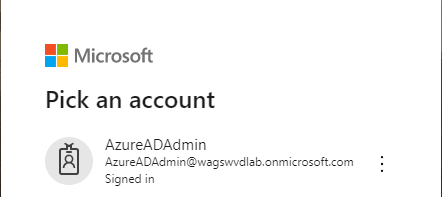

# Lab 5: Grant consent for WVD service

Creating a tenant in Windows Virtual Desktop is the first step toward building your desktop virtualization solution. A (WVD) tenant is a group of one or more host pools. With a (WVD) tenant, you can build host pools, create app groups, assign users, and make connections through the service. 

Before you can create a Windows Virtual Desktop tenant, you must allow Windows Virtual Desktop services to access your Azure AD tenant. The way Windows Virtual Desktop is designed requires explicit Azure AD consent. The process is much like how Azure requires you to enable non-standard resource providers before being able to use them.

## Exercise 1 - Enabling Server Registration and consent to Azure AD

1. Browse to the URL: [https://rdweb.wvd.microsoft.com.](https://rdweb.wvd.microsoft.com/)  
2. Select **Server App** from the dropdown and then paste your AAD ID in the field box. Click **Submit**.
3. If prompted, **Pick an account** that is your credentials for Azure Active Directory.
    
4. Click **Accept** on the Permissions requested page.

## Exercise 2 - Enabling Client Registration and consent to Azure AD

1. **WAIT ONE MINUTE** before proceeding. It can take about a minute for the server registration to complete. If you proceed to the next step too quickly, you may see an error.
2. Navigate back to [https://rdweb.wvd.microsoft.com ](https://rdweb.wvd.microsoft.com/)  
3. Next, From the drop down select **Client App** from the drop-down box and add the same AAD ID again then **Submit**.
4. If prompted, **Pick an account** that is your credentials for Azure Active Directory.
5. Click **Accept** on the permissions request page. Once this is complete you can close out of your browser session.

    >**NOTE**: If you receive an error that the page is not working or not available right now, click the button in your browser to go back one page and try again.

### Return to [Prepare Phase Labs](prepare.md)
