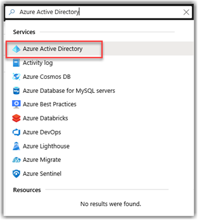
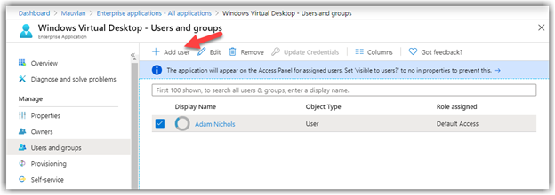
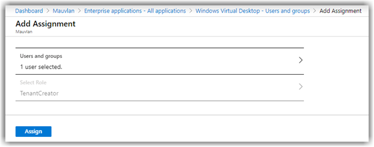

# Lab 7: Assign the “Tenant Creator” role to a user account 

Assigning an Azure Active Directory user the Tenant Creator application role allows that user to create a Windows Virtual Desktop tenant associated with the Azure Active Directory instance. You'll need to use your global administrator account to assign the Tenant Creator role. 

During this step you may notice the same account you used in the previous step listed as Default Access, this is not the same as Tenant Creator. So please be sure to complete the steps listed, and repeat if additional administrators will be provisioning WVD Tenants.

https://docs.microsoft.com/en-us/azure/virtual-desktop/tenant-setup-azure-active-directory#assign-the-tenantcreator-application-role

---
**Assigning WVD Tenant Creator Role:**

1. Go to the [Azure portal](https://portal.azure.com), search for and select **Azure Active Directory**.

   

2.  In the Middle Pane, click on **Enterprise applications**.

3.  Browes for and select the **Windows Virtual Desktop** application. 

    

4.  In the Middle Pane, select **Users and groups**.

5.  Select **Add user**, select **Users and groups**, and search for the user to
    whom you want to grant permissions to perform the Windows Virtual Desktop
    tenant creation. You should use the account created in the Azure AD section
    and the one you applied Global Admin rights to and should mimic this format,
    myaccountname@MyAADdomain.onmicrosoft.com

    

6.  Select the user and hit **Select,** followed by **Assign**.

     Your user should now have the role of “TenantCreator.”

   

### Return to [Prepare Phase Labs](prepare.md)

