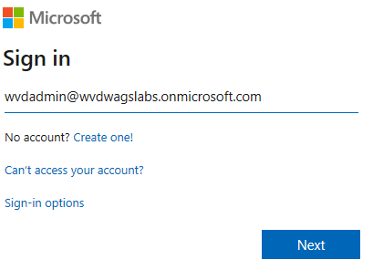
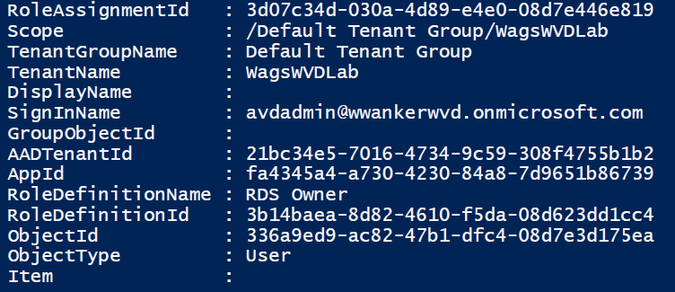

# Lab 6: Create a Windows Virtual Desktop Tenant

After assigning Tenant Creator role to your account you are now ready to provision your Windows Virtual Desktop Tenant. This is currently only achievable via PowerShell. Be sure to have the **Azure AD Tenant ID** and the **Subscription ID** collected earlier as you will use them to provision your tenant.

For more information visit [Create a Windows Virtual Desktop tenant](https://docs.microsoft.com/en-us/azure/virtual-desktop/tenant-setup-azure-active-directory#create-a-windows-virtual-desktop-tenant)

## Exercise 1 - Setting Deployment context

Capturing some of the commonly used strings into variables will make execution simpler as we execute various commands to provision our tenant. These variables will not change through out this entire deployment.  

1. From your desktop, open PowerShell (or PowerShell ISE) with Administrator credentials and enter the following:

```PowerShell
$brokerurl = "https://rdbroker.wvd.microsoft.com"
$aadTenantId = "Your Azure AD Tenant ID"
$azureSubscriptionId = "Your Subscription ID"
$SignInName = "AzureADAdmin@<yourAzureADdomain>.onmicrosoft.com"
$TenantName = "The name of your tenant"
```


   > Note: Make sure your tenant name has no special characters!

## Exercise 2 - Sign into Windows Virtual Desktop Services

   The Add-RdsAccount command will log you into the Windows Virtual Desktop Platform Service, the account used here should be the same account you granted Tenant Creator in an earlier exercise . You only need to authenticate once per session, but if you close PowerShell and reopen you will need to run this command-let every time you decide to provision your Windows Virtual Desktop Tenant, so it’s wise to keep this on hand.

1. From the same PowerShell with Administrator window enter the following:

   ```PowerShell
   Add-RdsAccount -DeploymentUrl $brokerurl
   ```

2. When prompted enter your WVDAdmin credentials (password is `Complex.Password`)

   > This was the account we granted Tenant Creator permission to.

     

## Exercise 3 - Provision your Windows Virtual Desktop Tenant

   The New-RDSTenant command-let will provision your new Tenant this will use your AAD Tenant ID and Subscription ID variables defined above. For the "Name" attribute in the command be sure to provide a unique name for your Windows Virtual Desktop tenant this will be used moving forward to identity the space in which you will deploy various host pools and resources.  

1. From the same PowerShell with Administrator window enter the following, entering the **correct tenant name**.

```PowerShell
New-RdsTenant -Name $TenantName -AadTenantId $aadTenantId -AzureSubscriptionId $azureSubscriptionId
```


## Exercise 4 - Add user roles to your Windows Virtual Desktop Tenant

Adding resources to your tenant is a critical step, at this point we will define a **RDS Owner** role to deploy and maintain host pools moving forward. In many cases you would provision the same account as RDS Owner as you did for Tenant Creator to ensure those users can manage all aspects of the WVD Environment. Later we will provision individual user access as necessary.

```PowerShell
New-RdsRoleAssignment -SignInName $SignInName -RoleDefinitionName "RDS Owner" -TenantName $TenantName -AadTenantId $aadTenantId
```



Congrats! You have now completed the steps to prepare your Windows Virtual Desktop enviorment.  

### Continue to Lab 7: [Deploy a Personal Host Pool](Deploy-Lab07-Deploy-a-Personal-Host-Pool.md)

### Continue to the [Prepare Phase Labs](../Prepare/prepare.md)
