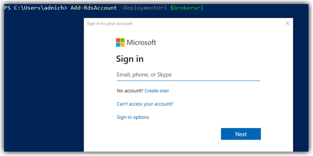
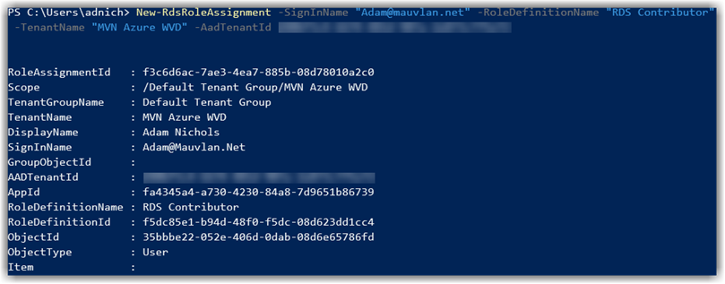

# Lab 4: Create a Windows Virtual Desktop Tenant 

After assigning Tenant Creator role to your account you are now ready to provision your Windows Virtual Desktop Tenant. This is currently only achievable via PowerShell. Be sure to have the **Azure AD Tenant ID** and the **Subscription ID** collected in Exercise 1 of this guide ready as you will use them to provision your tenant.

https://docs.microsoft.com/en-us/azure/virtual-desktop/tenant-setup-azure-active-directory#create-a-windows-virtual-desktop-tenant

## Lab 1. Install PowerShell modules

   This step is required to install the necessary PowerShell module to run any of the WVD or RDS command-lets. Install is only required once. But it dosnt hurt to run these again to ensure you have the latest updates. 

```PowerShell
Install-Module -Name Microsoft.RDInfra.RDPowerShell -Force
Import-Module -Name Microsoft.RDInfra.RDPowerShell -Force
```
---

## Lab 2 - Setting Deployment context

   Capturing some of the commonly used strings into variables will make execution simpler as we execute various commands to provision our tenant. These variables will not change through out this entire deployment.  

```PowerShell
$brokerurl = "https://rdbroker.wvd.microsoft.com"
$aadTenantId = "The Azure AD Tenant ID Captured During Exercise 1"
$azureSubscriptionId = "The Subscription ID Captured During Exercise 1"
```


---

**3. Sign into the WVD Services**

   The Add-RdsAccount command will log you into the WVD Platform Service, the account used here should be the same account you granted Tenant Creator in Exercise 3. You only need to authenticate once per session, but if you close PowerShell and reopen you will need to run this command-let every time you decide to provision your WVD Tenant, so it’s wise to keep this on hand.


```PowerShell
Add-RdsAccount -DeploymentUrl $brokerurl
```



---

**4. Provision your WVD Tenant**

   The New-RDSTenant command-let will provision your new Tenant this will use your AAD Tenant ID and Subscription ID variables defined above. For the "Name" attribute in the command be sure to provide a unique name for your WVD tenant this will be used moving forward to identity the space in which you will deploy various host pools and resources.  

```PowerShell
New-RdsTenant -Name "yourWVDTenantNamehere" -AadTenantId $aadTenantId -AzureSubscriptionId $azureSubscriptionId
```


---

**5. Add user roles to your WVD Tenant**

Adding resources to your tenant is a critical step, at this point we will define a **RDS Owner** role to deploy and maintain host pools moving forward. In many cases you would provision the same account as RDS Owner as you did for Tenant Creator to ensure those users can manage all aspects of the WVD Environment. Later we will provision individual user access as necessary.

```PowerShell
New-RdsRoleAssignment -SignInName "myaccount@MyAADdomain.onmicrosoft.com" -RoleDefinitionName "RDS Owner" -TenantName "TenantNameFromAbove" -AadTenantId $aadTenantId
```



