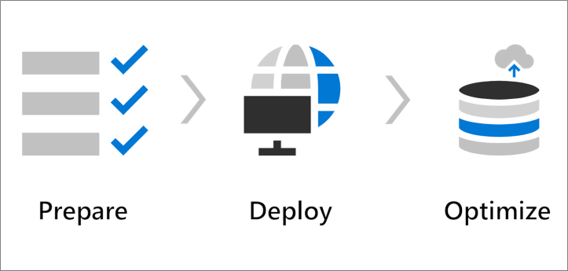

# Technical Intensity Workshop - Windows Virtual Desktop

## Overview

In this lab, attendees will deploy the [Windows Virtual Desktop
(WVD)](https://azure.microsoft.com/en-us/services/virtual-desktop/) *solution* .
Exclusively available as an Azure cloud service, Windows Virtual Desktop allows
you to choose a flexible end user virtualized application or desktop delivery
model that best aligns with your enterprise Azure cloud strategy. WVD simplifies
the IT model to virtualize and deploy modern and legacy desktop app experiences
with unified management—without needing to host, install, configure and manage
components such as diagnostics, networking, connection brokering, and gateway.
WVD brings together Microsoft Office 365 and Azure to provide users with the
only multi-session Windows 10 experience with exceptional scale and reduced IT
costs while empowering today’s modern digital workspace.

## Helpful Hints for this Lab

- Take your time, there is a lot of information to digest and go through.

- Make sure to keep track of what user accounts you are using and where you
    are using them.

- Regions and locations, make sure to stay consistent as much as possible.

- Terminology is important.

## Let's Get Started

There are three phases to implementing Windows Virtual Desktops:

1. [Prepare](prepare/prepare.md)
2. [Deploy](deploy/deploy.md)
3. [Optimize](optimize/optimize.md)

## Disclaimer

Information in this document, including URL and other Internet Web site
references, is subject to change without notice. Unless otherwise noted, the
example companies, organizations, products, domain names, e-mail addresses,
logos, people, places, and events depicted herein are fictitious, and no
association with any real company, organization, product, domain name, e-mail
address, logo, person, place or event is intended or should be inferred.
Complying with all applicable copyright laws is the responsibility of the user.
Without limiting the rights under copyright, no part of this document may be
reproduced, stored in or introduced into a retrieval system, or transmitted in
any form or by any means (electronic, mechanical, photocopying, recording, or
otherwise), or for any purpose, without the express written permission of
Microsoft Corporation.

Microsoft may have patents, patent applications, trademarks, copyrights, or
other intellectual property rights covering subject matter in this document.
Except as expressly provided in any written license agreement from Microsoft,
the furnishing of this document does not give you any license to these patents,
trademarks, copyrights, or other intellectual property.

The names of manufacturers, products, or URLs are provided for informational
purposes only and Microsoft makes no representations and warranties, either
expressed, implied, or statutory, regarding these manufacturers or the use of
the products with any Microsoft technologies. The inclusion of a manufacturer or
product does not imply endorsement of Microsoft of the manufacturer or product.
Links may be provided to third party sites. Such sites are not under the control
of Microsoft and Microsoft is not responsible for the contents of any linked
site or any link contained in a linked site, or any changes or updates to such
sites. Microsoft is not responsible for webcasting or any other form of
transmission received from any linked site. Microsoft is providing these links
to you only as a convenience, and the inclusion of any link does not imply
endorsement of Microsoft of the site or the products contained therein.

© 2020 Microsoft Corporation. All rights reserved.

Microsoft and the trademarks listed at [Microsoft Trademarks](https://www.microsoft.com/en-us/legal/intellectualproperty/Trademarks/Usage/General.aspx). All other trademarks are property of their respective owners.
